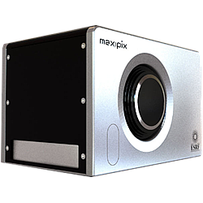

Maxipix
-------



Intoduction
```````````
MAXIPIX is a high spatial resolution (small pixels), high frame rate, photon-counting pixel detector developed by ESRF. MAXIPIX is based on MEDIPIX2/TIMEPIX readout ASICs developed by CERN and the MEDIPIX2 collaboration. The active detector element consists of a hybrid pixel circuit glued on a chipboard and connected to it with microwire connections. The hybrid pixel circuit consists itself of a pixelated semiconductor sensor connected to one or several readout ASICs by individual micro solder bumps on each pixel. Various module formats are available and may implement either MEDIPIX2 or TIMEPIX ASICs. Both ASICs have identical pixel geometries but different characteristics as regards principally the lowest energy threshold, the discriminator range, and the available detection modes.

We provide today Maxipix 5x1, 4x1 and 1x1 formats based on both TIMEPIX and MEDIPIX2 ASICs.

Beamlines are equiped with the detector and its own control computer based on the famous Ecrin/Trenton 4U rackable PC.

Module configuration
````````````````````

Maxipix python module need at least the lima core module.

The minimum configuration file is *config.inc* :

.. code-block:: sh

  COMPILE_CORE=1
  COMPILE_SIMULATOR=0
  COMPILE_SPS_IMAGE=1
  COMPILE_ESPIA=1
  COMPILE_FRELON=0
  COMPILE_MAXIPIX=1
  COMPILE_PILATUS=0
  COMPILE_CBF_SAVING=0
  export COMPILE_CORE COMPILE_SPS_IMAGE COMPILE_SIMULATOR \
         COMPILE_ESPIA COMPILE_FRELON COMPILE_MAXIPIX COMPILE_PILATUS \
         COMPILE_CBF_SAVING


See :ref:`Compilation`
